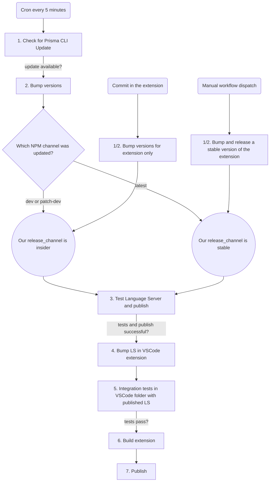

# Prisma Language Tools

Using the Language Server Protocol to improve Prisma's developer experience.

- [Prisma VS Code Extension](packages/vscode)

  - Install stable version (recommended) [Prisma](https://marketplace.visualstudio.com/items?itemName=Prisma.prisma):
    
  - or install the insider version (for Prisma developers) [Prisma Insider](https://marketplace.visualstudio.com/items?itemName=Prisma.prisma-insider): 

- [Language Server implementation](packages/language-server)

## Repository Structure

```
.
├── packages
│   └── vscode
│       └── src
|           └── extension.ts // Language Client entry point
|   └── language-server      // Language Server
│       └── src
│           └── cli.ts    // Language Server CLI entry point
└── package.json         // The extension manifest
```

## Build Status

- E2E Tests Status
  - [](https://github.com/prisma/language-tools/actions/workflows/e2e_published_vsix.yml?query=branch%3Amain)
  - [](https://github.com/prisma/language-tools/actions/workflows/5_e2e_tests.yml?query=branch%3Amain)
- Language Server Tests Status
  - [](https://github.com/prisma/language-tools/actions/workflows/3_LS_tests_publish.yml?query=branch%3Amain)

## CI release pipeline


