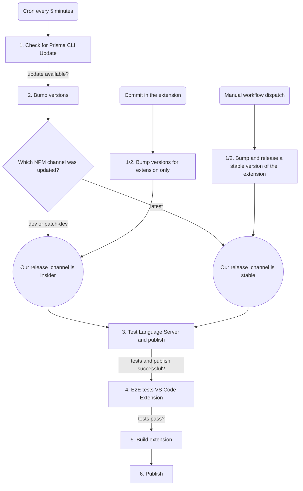

# CI/CD Overview

The repository has extensive GitHub Actions workflows:

| Workflow                  | Trigger            | Purpose                        |
| ------------------------- | ------------------ | ------------------------------ |
| `1_check_for_updates.yml` | Every 5 min (cron) | Checks for new Prisma releases |
| `2_bump_versions.yml`     | Triggered by #1    | Bumps Prisma dependencies      |
| `3_LS_tests_publish.yml`  | On version bump    | Tests and publishes LS to npm  |
| `4_e2e_tests.yml`         | Before releases    | Runs E2E tests                 |
| `5_build.yml`             | After E2E pass     | Builds extension               |
| `6_publish.yml`           | After build        | Publishes VS Code extension    |
| `PR_build_extension.yml`  | On PRs             | Builds `.vsix` for testing     |



## Testing PR Builds

When you open a PR, the `PR_build_extension.yml` workflow automatically builds a
`.vsix` file. To download and install it:

1. Go to the **Actions** tab in the GitHub repository
2. Find the workflow run for your PR (named "PR Build Extension" or similar)
3. Scroll to the **Artifacts** section at the bottom of the run summary
4. Download the `.vsix` artifact

Alternatively, download directly via command line:

```bash
wget --content-disposition \
  "https://github.com/prisma/language-tools/blob/artifacts/pull-request-artifacts/pr<PR_NUMBER>-prisma.vsix?raw=true"
```

Then install it with:

```bash
code --install-extension pr<PR_NUMBER>-prisma.vsix
```
