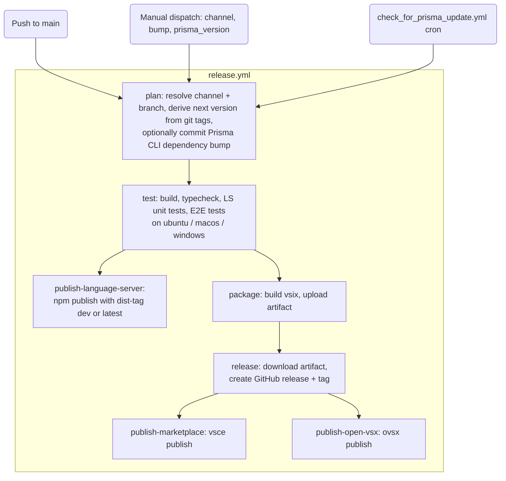

# CI/CD Overview

## Publishing pipeline

All publishing — insider **and** stable — happens in a single workflow:
[`release.yml`](../.github/workflows/release.yml). There are no chained
workflows and no version-bump commits: the next extension version is derived
from the git release tags (`x.y.z` for stable, `insider/x.y.z` for insider,
one shared monotonic counter). The only commit a release can create is a real
dependency bump when a new Prisma CLI version is passed in.

### Triggers

| Trigger                                        | Result                                                                    |
| ---------------------------------------------- | ------------------------------------------------------------------------- |
| Push to `main`                                 | Insider release                                                           |
| Manual `workflow_dispatch`                     | Insider or stable release, optional Prisma CLI bump, optional branch      |
| `check_for_prisma_update.yml` (cron, disabled) | Dispatches `release.yml` when a new Prisma CLI version is released on npm |

### Jobs


```mermaid
graph TD
    PUSH(Push to main) --> PLAN
    MANUAL(Manual dispatch: channel, bump, prisma_version) --> PLAN
    CRON(check_for_prisma_update.yml cron) --> PLAN

    subgraph release.yml
      PLAN[plan: resolve channel + branch, derive next version from git tags,<br>optionally commit Prisma CLI dependency bump]
      PLAN --> TEST[test: build, typecheck, LS unit tests, E2E tests<br>on ubuntu / macos / windows]
      TEST --> LS[publish-language-server:<br>npm publish with dist-tag dev or latest]
      TEST --> PKG[package: build vsix, upload artifact]
      PKG --> REL[release: download artifact,<br>create GitHub release + tag]
      REL --> MKT[publish-marketplace: vsce publish]
      REL --> OVSX[publish-open-vsx: ovsx publish]
    end
```

- **plan** resolves the release channel (`insider`/`stable`), the branch, and
  the next version, and outputs a single commit SHA that every later job
  checks out — no state is passed through commits mid-pipeline.
- **test** gates publishing: build, typecheck, Language Server unit tests and
  VS Code E2E tests on all three OSes.
- **package** builds the `.vsix` once; the same file is attached to the GitHub
  release and published to both marketplaces (passed as a workflow artifact).
- **release** only downloads that artifact and creates the tag and GitHub
  release. It does not check out, install or build anything.
- Insider GitHub releases are marked as pre-releases, so the repository's
  "latest release" always points to a stable version.

### Permissions

The workflow default is `contents: read`. Write access is granted per job:
`plan` (pushes the dependency-bump commit and can reset `stable`), `release`
(creates the tag and GitHub release) and `publish-language-server`
(`id-token: write` for npm Trusted Publishers). Every checkout except `plan`'s
sets `persist-credentials: false`, so build and test steps never see a git
credential.

Releases only run from `main`, `stable` or an `x.y.x` patch branch; `plan`
rejects any other `ref`.

### Channels and branches

| Channel | Branch          | Extension name   | LS npm dist-tag |
| ------- | --------------- | ---------------- | --------------- |
| insider | `main`          | `prisma-insider` | `dev`           |
| stable  | `stable`        | `prisma`         | `latest`        |
| insider | `x.y.x` patches | `prisma-insider` | `dev`           |

The `stable` branch pins the Prisma CLI `latest` dependencies while `main`
tracks `dev`. When a stable release ships a new Prisma minor or major, the
`plan` job resets `stable` to `main`. Patch releases for older versions are
made by dispatching `release.yml` with an `x.y.x` branch as `ref`
(channel `insider` for a `patch-dev` CLI, `stable` for the final patch).

### Prisma CLI update automation

[`check_for_prisma_update.yml`](../.github/workflows/check_for_prisma_update.yml)
(cron, currently disabled — dispatch manually) compares the npm versions of
`prisma@dev`, `prisma@latest` and `prisma@patch-dev` against
`scripts/versions/prisma_*`, records new versions there, and dispatches
`release.yml` for each channel that changed.

## Other workflows

| Workflow                               | Trigger             | Purpose                                      |
| -------------------------------------- | ------------------- | -------------------------------------------- |
| `continuous-integration.yml`           | PRs, push to main   | Tests, lint, typecheck, Playwright           |
| `PR_build_extension.yml`               | PRs                 | Builds a `.vsix` artifact for manual testing |
| `e2e_check_for_new_published_vsix.yml` | Cron (disabled)     | Detects new marketplace releases             |
| `e2e_published_vsix.yml`               | Dispatched by above | E2E tests against the published extension    |
| `codeql-analysis.yml`                  | PRs, push, cron     | CodeQL security analysis                     |
| `pr-code-security.yml`                 | PRs                 | Security checks                              |
| `update-api-types.yml`                 | Cron / manual       | Updates generated API types                  |

## Testing PR Builds

When you open a PR, the `PR_build_extension.yml` workflow automatically builds a
`.vsix` file. To download and install it:

1. Go to the **Actions** tab in the GitHub repository
2. Find the workflow run for your PR (named "PR Build Extension" or similar)
3. Scroll to the **Artifacts** section at the bottom of the run summary
4. Download the `.vsix` artifact

Alternatively, download directly via command line:

```bash
wget --content-disposition \
  "https://github.com/prisma/language-tools/blob/artifacts/pull-request-artifacts/pr<PR_NUMBER>-prisma.vsix?raw=true"
```

Then install it with:

```bash
code --install-extension pr<PR_NUMBER>-prisma.vsix
```
