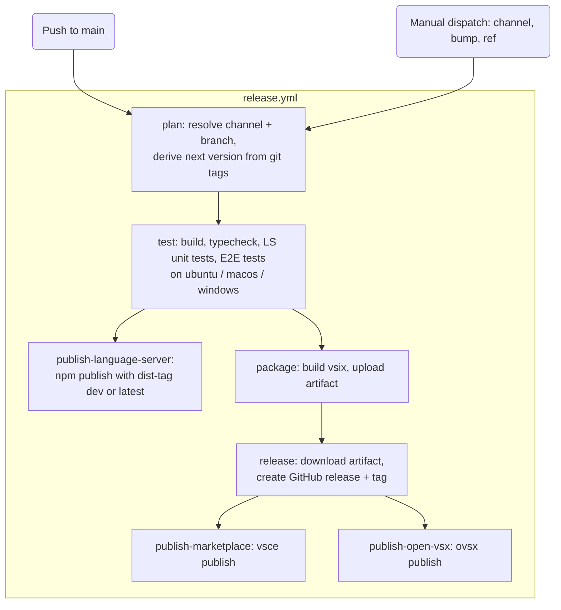

# CI/CD Overview

## Publishing pipeline

All publishing — insider **and** stable — happens in a single workflow:
[`release.yml`](../.github/workflows/release.yml). It **never writes to the
repository**. The next extension version is derived from the git release tags
(`x.y.z` for stable, `insider/x.y.z` for insider, one shared monotonic
counter), so releasing creates no bot commits. Prisma CLI dependency updates
are a separate workflow, [`bump_prisma.yml`](../.github/workflows/bump_prisma.yml).

Standard releases, insider and stable alike, are cut from `main`. Both channels
ship the same code and the same Prisma CLI pins; the channel only decides the
extension identity (`prisma` vs `prisma-insider`) and the Language Server npm
dist-tag. Patch releases for an older version are cut from the `x.y.x` branch
passed as `ref`, which must be given explicitly — `ref` defaults to `main`.

### Triggers

| Trigger                    | Result                                           |
| -------------------------- | ------------------------------------------------ |
| Push to `main`             | Insider release                                  |
| Manual `workflow_dispatch` | Insider or stable release, optional patch branch |

### Jobs


```mermaid
graph TD
    PUSH(Push to main) --> PLAN
    MANUAL(Manual dispatch: channel, bump, ref) --> PLAN

    subgraph release.yml
      PLAN[plan: resolve channel + branch,<br>derive next version from git tags]
      PLAN --> TEST[test: build, typecheck, LS unit tests, E2E tests<br>on ubuntu / macos / windows]
      TEST --> LS[publish-language-server:<br>npm publish with dist-tag dev or latest]
      TEST --> PKG[package: build vsix, upload artifact]
      PKG --> REL[release: download artifact,<br>create GitHub release + tag]
      REL --> MKT[publish-marketplace: vsce publish]
      REL --> OVSX[publish-open-vsx: ovsx publish]
    end
```

- **plan** resolves the release channel (`insider`/`stable`), the branch, and
  the next version, and outputs a single commit SHA that every later job
  checks out — no state is passed through commits mid-pipeline.
- **test** gates publishing: build, typecheck, Language Server unit tests and
  VS Code E2E tests on all three OSes.
- **package** builds the `.vsix` once; the same file is attached to the GitHub
  release and published to both marketplaces (passed as a workflow artifact).
- **release** only downloads that artifact and creates the tag and GitHub
  release. It does not check out, install or build anything.
- Insider GitHub releases are marked as pre-releases, so the repository's
  "latest release" always points to a stable version.

### Permissions

The workflow default is `contents: read`. Only two jobs are granted more:
`release` (`contents: write`, to create the tag and GitHub release) and
`publish-language-server` (`id-token: write`, for npm Trusted Publishers).
Every checkout sets `persist-credentials: false`, so no job has a git
credential in its config while running dependency code.

Releases only run from `main` or an `x.y.x` patch branch; `plan` rejects any
other `ref`.

### Channels

| Channel | Extension name   | Tag             | LS npm dist-tag |
| ------- | ---------------- | --------------- | --------------- |
| insider | `prisma-insider` | `insider/x.y.z` | `dev`           |
| stable  | `prisma`         | `x.y.z`         | `latest`        |

An insider release is always a patch bump. A stable release takes the `bump`
input (`patch`, `minor` or `major`, defaulting to `patch`). Both channels draw
from the same version counter, so a stable release picks up from the highest
tag either channel has reached.

To patch an older version, dispatch `release.yml` with an `x.y.x` branch as
`ref`.

## Prisma CLI dependency updates

[`bump_prisma.yml`](../.github/workflows/bump_prisma.yml) is the only workflow
that changes dependency pins. Dispatch it with a `prisma_version` (and
optionally a `ref` for a patch branch). It runs
`scripts/bump_prisma_dependencies.mjs`, which rewrites `@prisma/config`,
`@prisma/prisma-schema-wasm`, `@prisma/schema-files-loader`,
`prisma.enginesVersion` and `prisma.cliVersion` in
`packages/language-server/package.json`, refreshes the lockfile, and pushes one
commit.

That push to `main` triggers an insider release through `release.yml`. A stable
release on the new pins is a separate manual dispatch.

[`check_for_prisma_update.yml`](../.github/workflows/check_for_prisma_update.yml)
(cron, currently disabled — dispatch manually) compares the npm versions of
`prisma@dev`, `prisma@latest` and `prisma@patch-dev` against
`scripts/versions/prisma_*`, records new versions there, and dispatches
`bump_prisma.yml` for each channel that changed.

## Other workflows

| Workflow                               | Trigger             | Purpose                                      |
| -------------------------------------- | ------------------- | -------------------------------------------- |
| `continuous-integration.yml`           | PRs, push to main   | Tests, lint, typecheck, Playwright           |
| `PR_build_extension.yml`               | PRs                 | Builds a `.vsix` artifact for manual testing |
| `e2e_check_for_new_published_vsix.yml` | Cron (disabled)     | Detects new marketplace releases             |
| `e2e_published_vsix.yml`               | Dispatched by above | E2E tests against the published extension    |
| `codeql-analysis.yml`                  | PRs, push, cron     | CodeQL security analysis                     |
| `pr-code-security.yml`                 | PRs                 | Security checks                              |
| `update-api-types.yml`                 | Cron / manual       | Updates generated API types                  |

## Testing PR Builds

When you open a PR, the `PR_build_extension.yml` workflow automatically builds a
`.vsix` file. To download and install it:

1. Go to the **Actions** tab in the GitHub repository
2. Find the workflow run for your PR (named "PR Build Extension" or similar)
3. Scroll to the **Artifacts** section at the bottom of the run summary
4. Download the `.vsix` artifact

Alternatively, download directly via command line:

```bash
wget --content-disposition \
  "https://github.com/prisma/language-tools/blob/artifacts/pull-request-artifacts/pr<PR_NUMBER>-prisma.vsix?raw=true"
```

Then install it with:

```bash
code --install-extension pr<PR_NUMBER>-prisma.vsix
```
