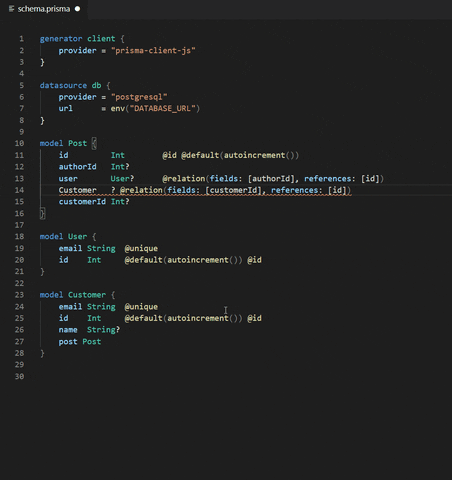

<h2 align="center">Prisma VS Code Extension</h2>
<div align="center">

[](https://marketplace.visualstudio.com/items?itemName=Prisma.prisma)
[](https://marketplace.visualstudio.com/items?itemName=Prisma.prisma)
[](https://marketplace.visualstudio.com/items?itemName=Prisma.prisma)

</div>
<hr>
Adds syntax highlighting, formatting, jump-to-definition and linting for [Prisma Schema](https://www.prisma.io/docs/concepts/components/prisma-schema) files.

## VSCode Marketplace

You can find both the [stable](https://marketplace.visualstudio.com/items?itemName=Prisma.prisma) and [Insider](https://marketplace.visualstudio.com/items?itemName=Prisma.prisma-insider) extension on the Marketplace.

## Open VSX Registry

You can find both the [stable](https://open-vsx.org/extension/Prisma/prisma) and [Insider](https://open-vsx.org/extension/Prisma/prisma-insider) extension on the Open VSX Registry.

## Features

- Syntax highlighting of `schema.prisma`
- Linting
  - Diagnostic tools are used to surface errors and warnings in your schema file as you type.
- Code Completion
  - Completion results appear for symbols as you type.
  - You can trigger this manually with the `Ctrl+Space` shortcut.
- Documentation help
  - Documentation of a completion result pops up as completion results are provided.
- Quick info on hover
  - Documentation Comments (`///`) of models and enums appear anywhere you hover over their usages.
- Go to Definition
  - Jump to or peek a model or enum's declaration.
- Formatting
  - Format code either manually or on save (if configured).
    - _To automatically format on save, add the following to your `settings.json` file:_
      ```
      "editor.formatOnSave": true
      ```
    - _To enable formatting in combination with `prettier`, add the following to your `settings.json` file:_
      ```
      "[prisma]": {
        "editor.defaultFormatter": "Prisma.prisma"
      },
      ```
      or use the [Prettier plugin for Prisma](https://github.com/umidbekk/prettier-plugin-prisma)
- Rename
  - Rename models, enums, fields and enum values
    - Click into the model or enum, press `F2` and then type the new desired name and press `Enter`
    - All usages will be renamed
    - Automatically applies `@map` or `@@map` on the schema
- Quick-fixes
  - Quickly fix typos in model and enum names
  - Create new models and enums with a single click

## Preview

<details>
  <summary>Syntax-Highlighting</summary>


</details>
<details>
  <summary>Quick-Fixes</summary>
  

</details>

## Contributing

Read more about [how to contribute to the Prisma VSCode extension](./CONTRIBUTING.md)

## Security

If you have a security issue to report, please contact us at [security@prisma.io](mailto:security@prisma.io?subject=[GitHub]%20Prisma%202%20Security%20Report%20VSCode)

## Build Status

- E2E Tests Status

  

  
